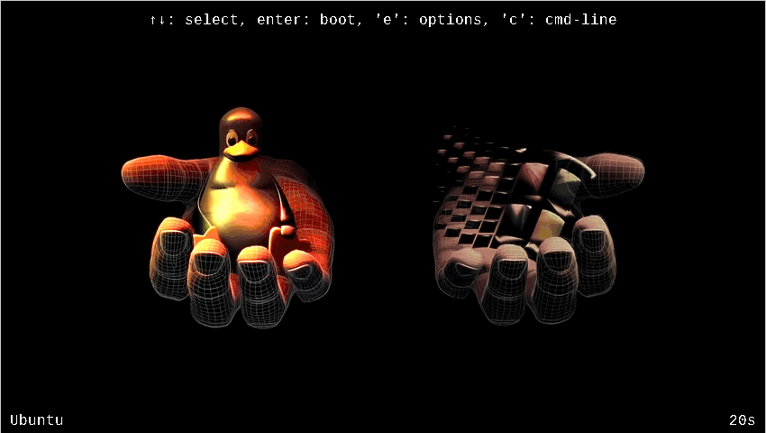

## WinTux Dualboot Fullscreen GRUB Theme

Based on artwork by ABOhiccups (https://www.pling.com/p/1497147)

I really liked this artwork and wondered why it was not a theme, just a picture. It seems in GRUB there is no straightforward way to make selection menu look anything other than vertical list of rows.

Presented here is unique theme that uses entry "icons" stretched full-screen to make each entry look exactly how I want. I have not seen this kind of approach used anywhere before.

Tools, EFI and Power icons are generated with neural networks.

### Preview

### Choose resolution
To find resolution supported by your GRUB:
* On the grub screen, press `c` to enter the command line
* Enter `vbeinfo` or `videoinfo`

### Installation
I recommend to use supplied `install.sh` script.
Although if you want to do it manually make sure to set `GRUB_GFXMODE` to exactly match chosen theme resolution.

### Build for your resolution
Use `build.sh` script. You need to have the following programs available:
* `grub-mkfont`
* `convert` from ImageMagick v6